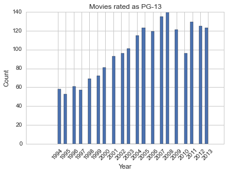
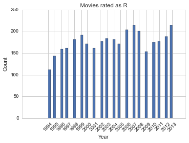
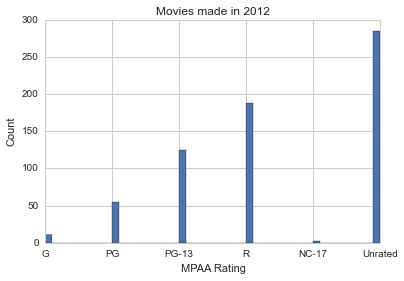

## MPAA Rating Analysis
###### This is a project from Week 2 & Week 3 of the Metis Data Science bootcamp.

#### Back story:

>Metis prompt: Using information we scrape from the web, can we build linear regression models from which we can learn about the movie industry?

There are a lot problems with the current MPAA rating system. We don't know who makes up the MPAA. Their standards are not transparent. They target independent film makers (more likely to receive an R rating without much explanation). My claim is that the MPAA rating will favor big studios, and milder ratings have positive correlation with box office gross.

#### Data:

 * **acquisition**: web scraping
 * **storage**: flat files
 * **sources**: boxofficemojo.com, any other publicly available information

#### Skills:

 * basics of the web (requests, HTML, CSS, JavaScript)
 * web scraping
 * `numpy` and `pandas`
 * `statsmodels`, `scikit-learn`

#### Analysis:

 * linear regression

#### Results:
##### General Trends:

 * We can see that there are more PG-13 movies being made as the years pass. The trend for R-rated movies is not so clear. 
 
 

 * Films slapped with an NC-17 rating have the option to reject the rating and be released as 'Unrated'. 

#### What else?

 * Find data for average number of submissions it takes for NC-17 film to get accepted as a R rating.
 * Account for inflation rate.
 * Scrape more rating sites such as kidsinmind.com and screenit.com

